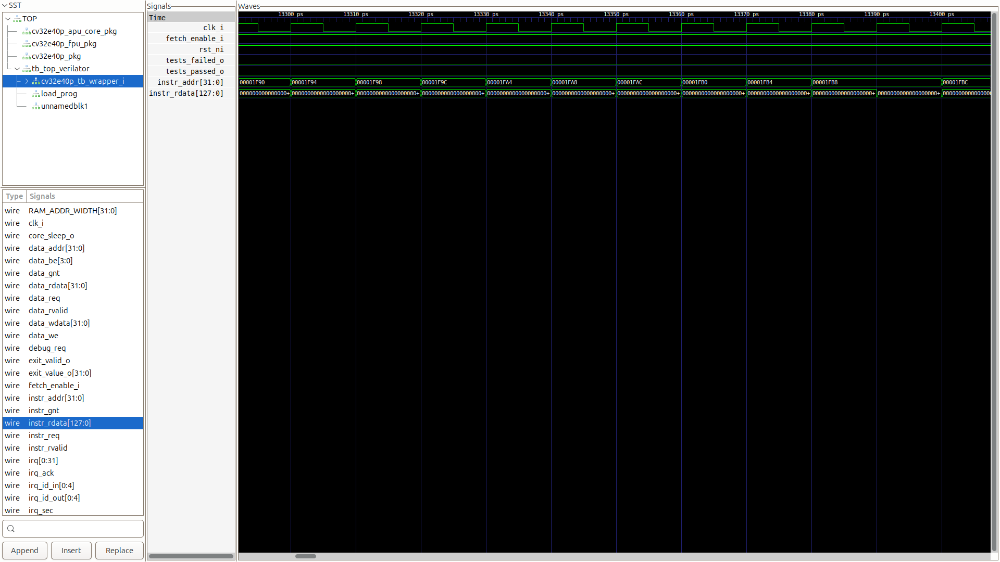

# CV32E40P "Quick Start" Verification Challenge

**Author:** Divyam Shankhdhar
**Status:** ✅ PASSED
**Simulator:** Verilator v5.008
**Toolchain:** LowRISC 20220524-1

## 🎯 Project Overview
This repository contains the functional verification environment for the OpenHW CV32E40P RISC-V processor core. The goal was to establish the toolchain, compile the testbench, and successfully execute the "Hello World" verification workflow.

## 📸 Validation Proofs

### 1. Successful Simulation Run
The "Hello World" test-program executed with `EXIT SUCCESS` status after 174,310 cycles.

### 2. Instruction Fetch Interface (Waveforms)
Analysis of the instruction fetch interface (`instr_addr_o`) shows the program counter incrementing sequentially, confirming the core is actively fetching instructions.

## 🛠️ Friction Point & Resolution
**The Challenge:**
The documentation-referenced 2023 LowRISC toolchain artifact returned HTTP 404 errors. Furthermore, the default system compiler (`gcc-riscv64-unknown-elf`) failed due to missing Newlib headers (`sys/stat.h`), preventing BSP compilation.

**The Fix:**
I manually deployed the stable **LowRISC 20220524-1** artifact. To resolve persistent `No such file` errors caused by relative paths in the Makefile, I architected a "clean-slate" installation script using dynamic absolute path assignment (`export RISCV=$(pwd)`) to hard-code the toolchain location.
